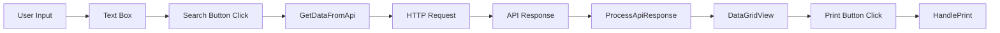

## Overview

Daikin Etiquetas is a .NET 8.0 Windows Forms application built for managing and printing supplier part number labels. The application follows a classic Windows Forms architecture with a single main form handling UI interactions, API communication, and business logic.

## Project Structure

```text
Etiquetas/
├── Etiquetas.csproj      # Project configuration
├── Program.cs            # Application entry point
├── Form1.cs              # Main form logic and API integration
├── Form1.Designer.cs     # UI component definitions
├── Form1.resx            # Form resources
├── Properties/           # Application properties
└── Resources/            # Embedded resources (images, logos)
```

## Technology Stack

<ParamField path="Framework" type="string">
  .NET 8.0 Windows Forms (`net8.0-windows`)
</ParamField>

<ParamField path="UI Framework" type="string">
  Windows Forms with custom styling
</ParamField>

<ParamField path="HTTP Client" type="library">
  System.Net.Http 4.3.4
</ParamField>

<ParamField path="JSON Serialization" type="library">
  System.Text.Json (built-in)
</ParamField>

## Application Entry Point

The application starts in `Program.cs` with the standard Windows Forms initialization pattern:

```csharp Program.cs
internal static class Program
{
    [STAThread]
    static void Main()
    {
        ApplicationConfiguration.Initialize();
        Application.Run(new Form1());
    }
}
```

### Key Initialization Steps

1. **ApplicationConfiguration.Initialize()** - Configures application-wide settings (DPI, fonts)
2. **Application.Run(new Form1())** - Creates and displays the main form
3. **[STAThread]** - Required for Windows Forms COM interop

## Main Form Architecture

The `Form1` class serves as the application's primary controller, managing:

### State Management

```csharp Form1.cs
public partial class Form1 : Form
{
    int posY = 0;  // Y position for form dragging
    int posX = 0;  // X position for form dragging
    
    public Form1()
    {
        InitializeComponent();
        daikinPartN_tbl.Visible = false;  // Hide results initially
        SetupDataGridView();              // Configure grid columns
    }
}
```

### Component Responsibilities

| Component | Responsibility |
|-----------|---------------|
| **Form1.cs** | Event handlers, API integration, business logic |
| **Form1.Designer.cs** | UI component initialization and layout |
| **Form1.resx** | Embedded resources (images, icons) |

## Data Flow

The application follows this data flow pattern:



### Flow Sequence

1. **User enters Supplier Part Number** in `txtSupplierP_N` text box
2. **User clicks Search** - triggers `btnSearch_Click` event
3. **Validation** - checks if input is not empty or placeholder text
4. **API Request** - `GetDataFromApi()` sends HTTP GET request
5. **Response Processing** - `ProcessApiResponse()` deserializes JSON
6. **Display Results** - populates `daikinPartN_tbl` DataGridView
7. **User clicks Print** - triggers `daikinPartN_tbl_CellClick` event
8. **Print Handler** - `HandlePrint()` processes the selected row

## State Management

### Form State Variables

<ParamField path="posX" type="int">
  X coordinate for form dragging functionality
</ParamField>

<ParamField path="posY" type="int">
  Y coordinate for form dragging functionality
</ParamField>

### UI State Management

The application manages UI state through:

- **Visibility toggles** - `daikinPartN_tbl.Visible`, `lblSupplierPartNumber.Visible`
- **Dynamic styling** - Font and color changes on text input
- **Event-driven updates** - MouseHover, TextChanged, Click events

## Design Patterns

### Async/Await Pattern

API calls use async/await for non-blocking UI:

```csharp Form1.cs:95-105
private async void btnSearch_Click(object sender, EventArgs e)
{
    if (string.IsNullOrWhiteSpace(txtSupplierP_N.Text) || 
        txtSupplierP_N.Text == "Supplier Part Number")
    {
        MessageBox.Show("Please enter a Supplier Part Number", 
                        "Warning", MessageBoxButtons.OK, MessageBoxIcon.Warning);
        return;
    }
    
    daikinPartN_tbl.Visible = true;
    await GetDataFromApi();
}
```

### Event-Driven Architecture

All user interactions are handled through Windows Forms events:

- Mouse events (Click, Hover, Leave, Move)
- Text change events
- DataGridView cell click events

## Custom UI Features

### Borderless Form with Custom Title Bar

```csharp Form1.Designer.cs:219
FormBorderStyle = FormBorderStyle.None;
StartPosition = FormStartPosition.CenterScreen;
```

### Draggable Window

Implemented through mouse move tracking:

```csharp Form1.cs:81-93
private void moveFrm(MouseEventArgs e)
{
    if (e.Button != MouseButtons.Left)
    {
        posX = e.X;
        posY = e.Y;
    }
    else
    {
        Left = Left + e.X - posX;
        Top = Top + (e.Y - posY);
    }
}
```

## Color Scheme

The application uses a dark theme:

- **Background**: `Color.FromArgb(45, 45, 45)` - Dark gray
- **Title Bar**: `Color.FromArgb(30, 30, 30)` - Darker gray
- **Text**: `Color.FromArgb(250, 250, 250)` - Near white
- **Placeholder**: `Color.FromArgb(150, 150, 150)` - Medium gray

## Error Handling

See [API Integration](/developer-guide/api-integration) for detailed error handling patterns.