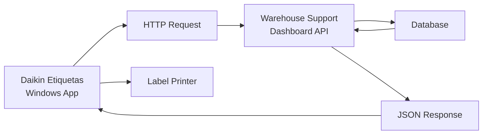

## What is Daikin Etiquetas?

Daikin Etiquetas is a Windows Forms desktop application designed to streamline warehouse operations by enabling quick lookups and label printing for Daikin part numbers based on supplier part numbers.

<Info>
**Target Audience**: Warehouse staff and inventory management personnel who need to quickly identify and label Daikin parts using supplier part numbers.
</Info>

## Key Features

<CardGroup cols={2}>
  <Card title="Fast Part Number Lookup" icon="magnifying-glass">
    Search for Daikin part numbers using supplier part numbers with real-time API integration
  </Card>
  
  <Card title="Label Printing" icon="print">
    Generate and print labels directly from search results with a single click
  </Card>
  
  <Card title="Clean Interface" icon="window-maximize">
    Modern, intuitive Windows Forms interface designed for quick data entry and minimal clicks
  </Card>
  
  <Card title="API Integration" icon="cloud">
    Connects to Warehouse Support Dashboard API for real-time part number data
  </Card>
</CardGroup>

## How It Works

The application provides a streamlined workflow:

1. **Enter Supplier Part Number** - Input the supplier's part number into the search field
2. **Search API** - The application queries the Warehouse Support Dashboard API
3. **View Results** - Matching Daikin part numbers are displayed in a results table
4. **Print Labels** - Click the Print button next to any result to generate a label

## System Architecture



### Technical Stack

- **Framework**: .NET 8.0 Windows Forms
- **Language**: C#
- **HTTP Client**: System.Net.Http
- **Data Format**: JSON serialization/deserialization
- **API Endpoint**: `https://azuappsrvuat01v.mcquay.com/SupportDashboard`

<Note>
The application uses the Warehouse Support Dashboard API report endpoint (ID: 2167) to retrieve part number mappings.
</Note>

## API Integration

The application integrates with the Warehouse Support Dashboard API using the following endpoint:

```csharp
string url = $"https://azuappsrvuat01v.mcquay.com/SupportDashboard/Home/GetReportData?id=2167&parameters={{\"supplier_part_number\":\"{supplierPartNumber}\"}}";
```

The API returns a JSON array containing matching records with the following structure:

```json
[
  {
    "Supplier_Part_number": "ABC123",
    "Daikin_Part_Number": "DKN456"
  }
]
```

## Benefits

<CardGroup cols={2}>
  <Card title="Increased Efficiency" icon="bolt">
    Reduces time spent manually looking up part numbers in spreadsheets or databases
  </Card>
  
  <Card title="Error Reduction" icon="shield-check">
    Eliminates manual transcription errors by printing labels directly from verified data
  </Card>
  
  <Card title="Real-time Data" icon="refresh">
    Always accesses the latest part number mappings from the central database
  </Card>
  
  <Card title="Simple Operation" icon="user-check">
    Minimal training required with straightforward search and print workflow
  </Card>
</CardGroup>

## Next Steps

<CardGroup cols={2}>
  <Card title="Installation" icon="download" href="/installation">
    Learn how to install and configure Daikin Etiquetas
  </Card>
  
  <Card title="Quick Start" icon="rocket" href="/quickstart">
    Get started with your first search and print operation
  </Card>
</CardGroup>
